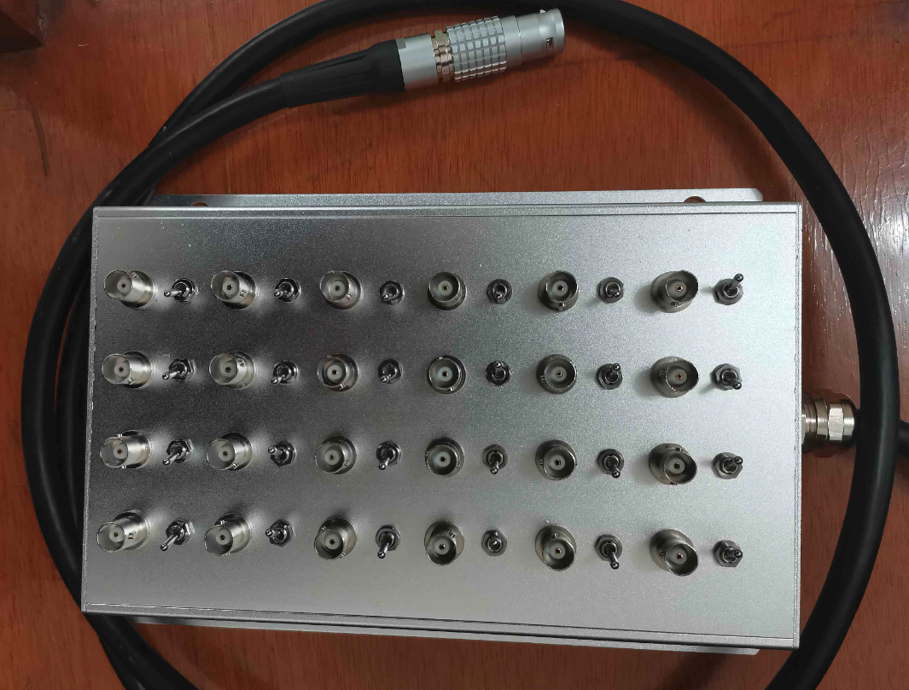

# 量子输运（个人总结）

#介观输运 #Quantum Point Contact #Quantum Dot #Shot Noise

## 说明

- 研究生期间关于量子输运实验的一些经验和工作总结，希望有所帮助。有任何疑惑，或者建议，欢迎联系我：yuexiaokai@outlook.com；
- 如果readme文件中有乱码的latex公式，需要将文件下载下来，用Markdown编辑器查看，推荐使用Typora（最优雅方便的Markdown编辑器）；

## 现有内容

### 1. **电脑设置：** 

**说明：** 如何实现电脑与实验仪器之间的通讯，包括一些必要的硬件软件的使用。

### 2. 用python实现自动化测量

**说明：** 如何用python代替Labview，搭建带图形界面的程序，实现自动化测量。在QuantumTransportExpSoftware文件夹里有该测量软件的python源代码（QTL），以及用pyinstaller打包得到的可执行文件（win10Exe），如果有兴趣，可以尝试下载下来，玩一玩。

**TODO**：将程序拆成各个独立的模块，程序结构更加简洁。

### 3. 一些必要仪器的使用方法

**包括：** 

- 电压源（GS210,GS610）
- 锁相放大器（LI5650，SR830，UHF600MHz）
- 网络分析仪（N5244A）
- 超导强磁场（VRM）
- 采集卡（PCI6289，PCI6230）
- 8648D 射频源
- AWG70002A 任意波形发生器
- 还有一些器件（HMC928压控移相器，NF低噪声放大器，毅鑫奥达功分器）

### 4. 如何制作BNC转Lemo接线盒

### 5. 锁相放大器基本原理

